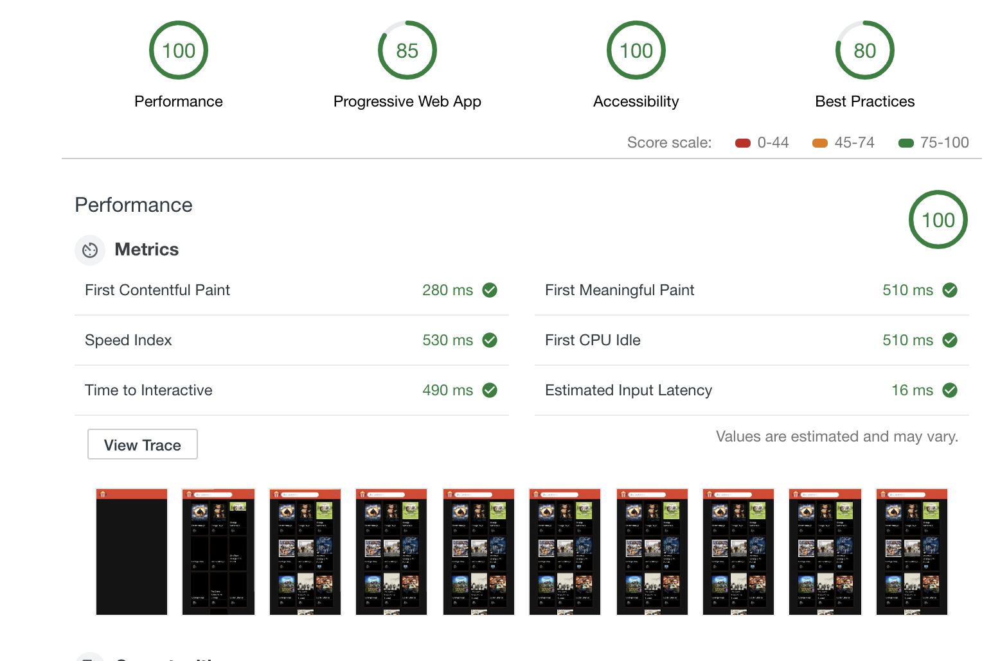

## Instant Movie Search Progressive Web Application


This application uses Open Movie Database API to perform an instant search on the movies. It uses Service Workers and follows best practices and accibility metrics of


### Technologies Used

- JavaScript
    This application is built with JavaScript only.( No UI View Framework )
    Node 10.x and npm 6.x is required to run the code in this repository.

- CSS
    No CSS processor has been used.

- Web Components
    Custom Web Components has been used to isolated each component logic  and also help modularizing the code. Each component is responsible for maininting it's own state and handling it's own events.

- Parcel
    Parcel is used for bundling JavaScript, CSS and other Assets.
    Parcel is a lighweight bundler and it is suitable for small applications.

- RxJS
    When it comes to handling events RxJS can sometimes make it really easy.

- NProgress
    NProgress is a JavaScript Library for page-level progress bar.


### How to build and run the application

1- Install dependencies:

```
npm isntall
```

3- Build and Start the server

```
npm run start
```

### Notes on implementation

#### Responsiveness

    The page design has been done solely with CSS. Flexbox layout model has been used to ensure responsiveness of the multi-column layout. In addition to flexbox, utilization of media queries for different view sizes enabled having acceptable design in smaller devices.

#### Performance and Network requests

*  Instant Search Input

    When it comes to search inputs, it is crucial to know how to prevent generating a load of XHR calls for every letter typed in. We don't want to make an API request on every letter user types. On the other hand we would like to wait until user stopped typing, and then make an API call. This approach will reduce the number of triggered requests. To achieve this here, RxJS librariy is used.

    With RxJS we are subscribing to input events such as the "keyup" event. We use RxJS debounceTime function to create the pause we need before we make a request. But what if user already made an XHR call to the API server? That is why "switchMap" function is used to abort the previous busy XHR call user has already made.

    ``` javascript
    this._inputSubscription = fromEvent(this._searchInput, 'keyup')
        // Pass all input values on keyup
        .pipe(map(e => e.target.value === '' ?  'Strange' : e.target.value))
        // pause for 750 ms
        .pipe(debounceTime(750))
        // Pass events only if value has changed
        .pipe(distinctUntilChanged())
        // use switch map to cancel previous busy calls and make a new XHR call
        .pipe(switchMap(ApiService.searchByTitle))
        .subscribe(movies => {
            NProgress.done();
            DomService.drawMovieCards(movies);
        });
    ```

* Application Shell Architecture

    The application shell architecture is a set of standards that focus on providing a fast-loading experience to users, pioneered by Google. Using an app shell architecture allows you to give your progressive web apps similar properties of native apps, like instant loading and regular updates.
    In this application we leveraged this architecture to instanyly render the shell of application before rendering other assets to provide a smooth experience. This specially will help smooth up the loading experience over slow network connection.
    Read more about application shell architecture [here](https://developers.google.com/web/fundamentals/architecture/app-shell)

* Service Workers and offline

    Of couse, when it comes to PWAs offline experience is a must. Network connections are not always reliable and based on research users will not feel good seeing nothing can load on their application when they have poor or no connection. Here we impkemented a simple approach for service-workers.
    When the request contains the API URL, the app is asking for fresh movie data. In this case, the service worker always goes to the network and then caches the response. This is called the "Cache then netwo strategy. Otherwise it will load the cached application shell.
    All logic for service workers can be found at ./service-worker.js

#### Browser Compatibility

    This application is compatible with Chrome(v.70+) and Firefox(v.63+).
    I used web components for modularity and it did took away the compatibility for Microsoft Edge and Internet Explorer.


### Testing

[CodeceptJS](https://codecept.io/) and [Puppeteer](https://github.com/GoogleChrome/puppeteer) has been used for end-to-end testing of this application.

To tun tests simply run:

```
npm run test
```

### Audit Results
This application is considered a PWA. The missing features are HTTPS and HHTP2 which are out of the scope of this project.




### Possible Enhancements
- Enable Virtual Scrolling so that more movies fetch from the server when user scroll down.
- Fix the issue with Parcel not being able to import the web component linked style.
- Resize API images to keep the right aspect ratio.
- Enable using webp image extentions on Chrome only.
